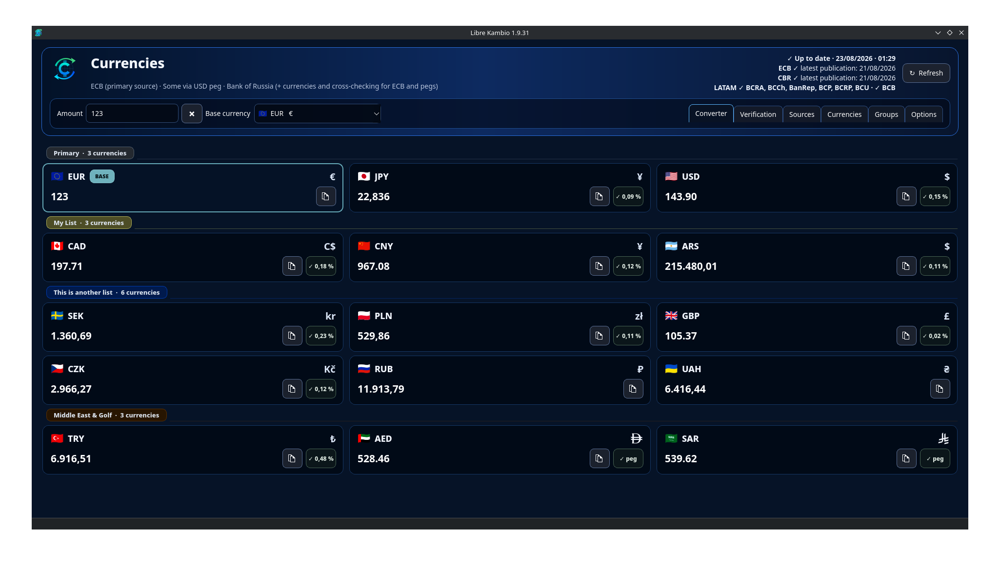
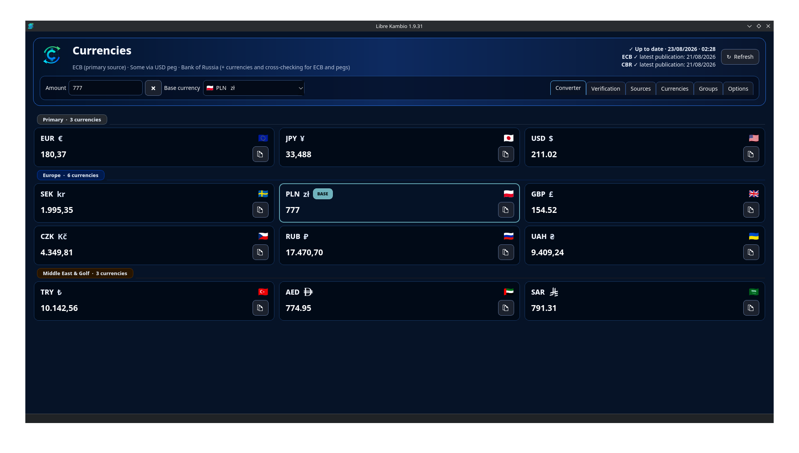
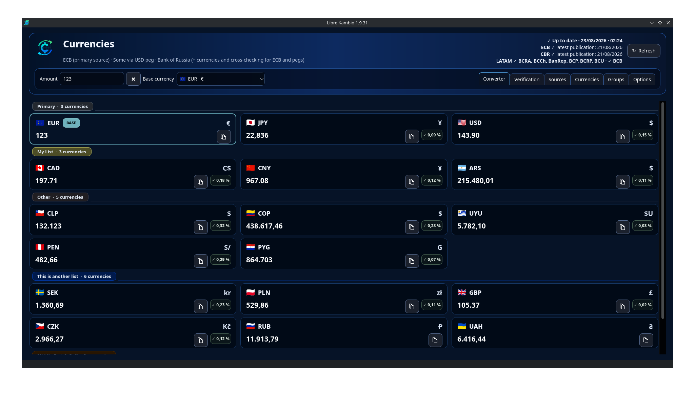
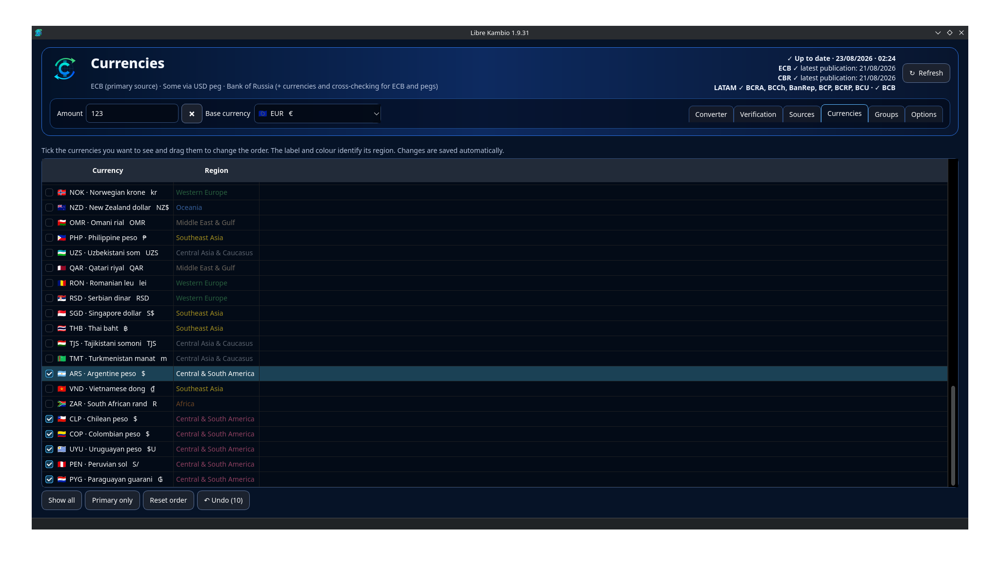
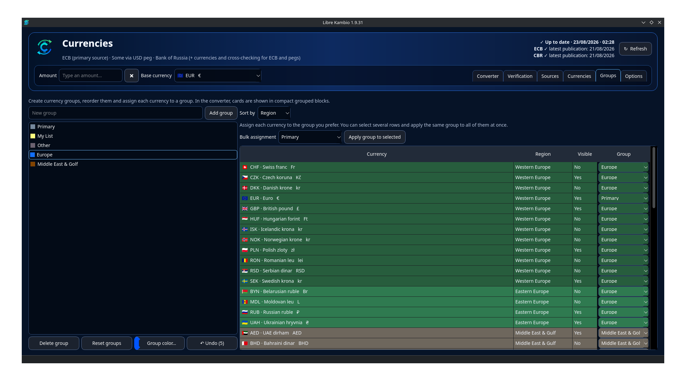
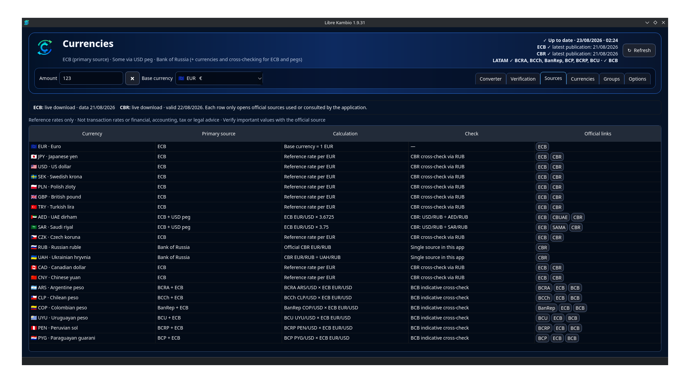
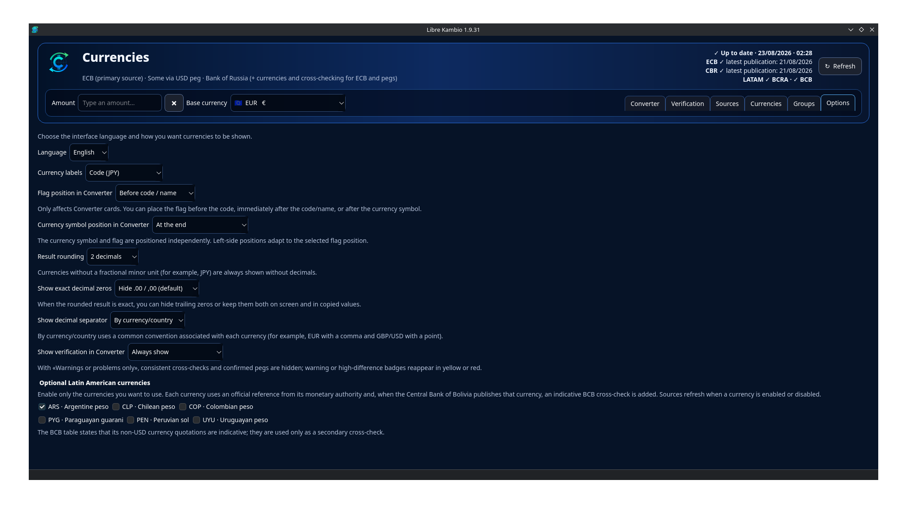

# Libre Kambio

[](https://github.com/h2o7y/Libre-Kambio/actions/workflows/ci.yml)
[](LICENSE)

**Conversor de divisas de código abierto para Linux**

Conversión instantánea y simultánea en múltiples divisas usando datos oficiales de tipos de cambio del **Banco Central Europeo (BCE)**, el **Banco de Rusia (CBR)** y, opcionalmente, determinados bancos centrales de Hispanoamérica.

**Versión actual: 1.9.33**

[English](README.md)

## Por qué Libre Kambio

Libre Kambio es un conversor de divisas de escritorio para Linux, respetuoso con la privacidad y basado en datos oficiales de bancos centrales en lugar de agregadores comerciales de tipos de cambio.

- **Conversión instantánea multidivisa:** introduce una cantidad una sola vez y consulta simultáneamente la conversión en todas las divisas visibles.
- **BCE como fuente principal:** los tipos de referencia del euro compatibles proceden principalmente del Banco Central Europeo.
- **Datos del Banco de Rusia:** los tipos oficiales del Banco de Rusia aportan divisas adicionales y comprobación independiente cuando corresponde.
- **Pegs oficiales al USD:** determinadas divisas utilizan su relación oficial fija con el dólar cuando procede.
- **Fuentes hispanoamericanas opcionales:** ARS, CLP, COP, PYG, PEN y UYU se pueden activar individualmente y utilizan sus respectivas autoridades monetarias oficiales.
- **Comprobación independiente:** la app mantiene separadas las fuentes principales y las de verificación y muestra fechas/estados de publicación.
- **Organización flexible:** grupos personalizados, orden manual, organización regional y controles de visibilidad.
- **Interfaz bilingüe:** español e inglés, con selección manual persistente.
- **Privacidad:** sin cuentas, analítica ni telemetría; el Flatpak solo solicita red y Wayland.

**Datos oficiales de bancos centrales · Conversión instantánea multidivisa · BCE + Banco de Rusia · Pegs USD · Comprobación independiente · Bancos centrales hispanoamericanos opcionales · Organización personalizada · Privacidad · Código abierto · Escritorio Linux**


## Capturas de pantalla

### Conversión instantánea multidivisa



### Moneda base flexible

Puedes elegir cualquier divisa compatible como moneda base y recalcular instantáneamente todas las divisas visibles.



### Divisas hispanoamericanas opcionales



### Gestión de divisas

Controla la visibilidad, el orden y la organización regional de las divisas.



### Grupos personalizados

Crea tus propios grupos de divisas y ordénalos según tus necesidades.



### Fuentes oficiales

Consulta la fuente oficial y el método de cálculo utilizado para cada divisa.



### Opciones

Personaliza etiquetas, símbolos, formato decimal, comprobaciones y divisas opcionales.



## Divisas compatibles (65)

Libre Kambio admite actualmente **65 divisas**:

**BCE / tipos de referencia del euro (30):**  
EUR, USD, JPY, CZK, DKK, GBP, HUF, PLN, RON, SEK, CHF, ISK, NOK, TRY, AUD, BRL, CAD, CNY, HKD, IDR, ILS, INR, KRW, MXN, MYR, NZD, PHP, SGD, THB, ZAR

**Banco de Rusia (24):**  
RUB, UAH, AZN, DZD, AMD, BYN, BOB, VND, EGP, IRR, CUP, MMK, GEL, MDL, NGN, TMT, RSD, KGS, TJS, BDT, KZT, MNT, UZS, ETB

**Pegs oficiales al USD (5):**  
AED, SAR, QAR, BHD, OMR

**Divisas opcionales de bancos centrales hispanoamericanos (6):**  
ARS, CLP, COP, PYG, PEN, UYU

Las divisas hispanoamericanas opcionales se pueden activar individualmente desde las opciones de la aplicación.

## Compatibilidad

**Entorno probado:** Fedora KDE Plasma sobre Wayland.

Libre Kambio se distribuye como **Flatpak** y se espera que funcione en distribuciones Linux modernas x86_64 con soporte para Flatpak y Wayland. Otras distribuciones y entornos de escritorio todavía no se han probado de forma exhaustiva.

La compilación Flatpak actual está destinada a **x86_64** y **Wayland**. Las sesiones exclusivamente X11 y otras arquitecturas de CPU no están soportadas actualmente por la compilación publicada.

## Aviso importante

> **Información de referencia únicamente.** Los tipos de cambio y las conversiones pueden estar retrasados, incompletos o ser inexactos y no se garantizan como tipos transaccionales. Libre Kambio no presta asesoramiento financiero, de inversión, contable, fiscal ni jurídico. Verifica los valores importantes con la fuente oficial original y, cuando corresponda, con tu banco o asesor profesional. **El uso del software y de sus resultados se realiza bajo tu propia responsabilidad.**

La exclusión completa de garantías y la limitación de responsabilidad están en [`DISCLAIMER.es.md`](DISCLAIMER.es.md). Se aplican además de las disposiciones de garantía y responsabilidad de la GNU GPLv3 y únicamente en la medida máxima permitida por la legislación aplicable.

## Seguridad de las fuentes

Libre Kambio es deliberadamente conservador con los datos antiguos o ausentes:

- Si falla la red o una fuente, la app puede usar el último valor guardado correctamente y lo marca claramente como copia local.
- Si se alcanza correctamente una publicación oficial pero falta el tipo esperado, la app **no** reutiliza silenciosamente un valor anterior para esa divisa.
- Las comprobaciones cruzadas nunca se presentan como fuentes principales.
- Las fechas y estados de las fuentes permanecen visibles para no ocultar diferencias entre días de publicación.

Los parsers y sus pruebas de regresión están en [`rates.py`](rates.py), [`latam_rates.py`](latam_rates.py) y [`tests/`](tests/).

## Fuentes oficiales

| Uso | Autoridad |
|---|---|
| Tipos de referencia EUR principales | Banco Central Europeo (BCE/ECB) |
| RUB, UAH, divisas adicionales y comprobación | Banco de Rusia (CBR) |
| Peg AED | Banco Central de EAU |
| Peg SAR | Saudi Central Bank (SAMA) |
| Peg QAR | Qatar Central Bank |
| Paridad BHD | Central Bank of Bahrain |
| Paridad OMR | Central Bank of Oman |
| ARS | Banco Central de la República Argentina (BCRA) |
| CLP | Banco Central de Chile (BCCh) |
| COP | Banco de la República (Colombia) |
| PYG | Banco Central del Paraguay (BCP) |
| PEN | Banco Central de Reserva del Perú (BCRP) |
| UYU | Banco Central del Uruguay (BCU) |
| Comprobación secundaria indicativa opcional | Banco Central de Bolivia (BCB) |

Las URL de las fuentes se conservan en el código para que puedan auditarse. Estas instituciones **no patrocinan, respaldan, mantienen ni garantizan Libre Kambio**. Consulta [`NOTICE.md`](NOTICE.md).

El propio BCE indica que sus tipos de cambio de referencia del euro se publican con fines informativos y desaconseja firmemente su uso con fines transaccionales. Por ello Libre Kambio trata todos los tipos mostrados como información de referencia, no como precios ejecutables de mercado.

## Privacidad y permisos Flatpak

El manifiesto Flatpak concede únicamente:

- `--share=network` — necesario para descargar publicaciones oficiales de tipos de cambio.
- `--socket=wayland` — necesario para mostrar la interfaz.

No solicita acceso a `$HOME`, Documentos, Descargas, dispositivos, audio, cámara, micrófono, X11 ni al bus del sistema.

Las preferencias locales y los últimos datos correctos de las fuentes se guardan dentro del área de datos/configuración de la aplicación Flatpak. El permiso de red de Flatpak es general, no limitado por dominio; el código de la aplicación solicita los endpoints oficiales definidos en [`rates.py`](rates.py) y [`latam_rates.py`](latam_rates.py).

## Instalación en Fedora KDE

El script incluido instala las herramientas/runtimes Flatpak necesarios cuando hacen falta, ejecuta las pruebas automáticas, construye la aplicación, la instala para el usuario actual y realiza una prueba de arranque GUI fuera de pantalla dentro del sandbox instalado.

```bash
./build-and-install-flatpak.sh
```

Abrir:

```bash
flatpak run io.github.h2o7y.LibreKambioCurrency
```

Comprobar los permisos efectivos:

```bash
flatpak info --show-permissions io.github.h2o7y.LibreKambioCurrency
```

El nombre visible del producto es **Libre Kambio**. Se mantiene el identificador Flatpak existente `io.github.h2o7y.LibreKambioCurrency` para conservar la identidad de la aplicación y la compatibilidad entre actualizaciones.

## Crear un `.flatpak` reutilizable

```bash
./build-bundle-flatpak.sh
```

En la versión 1.9.33 genera:

```text
Libre-Kambio-1.9.33.flatpak
```

## Comprobaciones de desarrollo

Las pruebas de lógica y parsers no necesitan PySide6:

```bash
./scripts/check-release.sh
```

Comandos principales equivalentes:

```bash
python3 -m py_compile main.py app_logic.py rates.py latam_rates.py
python3 -m json.tool io.github.h2o7y.LibreKambioCurrency.json >/dev/null
python3 -m unittest discover -s tests -v
```

GitHub Actions ejecuta las comprobaciones en pushes y pull requests. Otro workflow permite construir un bundle Flatpak manualmente o para etiquetas de versión.

## Declaración sobre desarrollo asistido por IA

Libre Kambio se ha desarrollado con **asistencia de IA generativa**, incluida asistencia en código fuente, pruebas y documentación. El mantenedor del proyecto selecciona, revisa, integra, prueba y mantiene el proyecto publicado.

Esta declaración es deliberadamente transparente. La asistencia de IA no transfiere responsabilidad ni aporta garantía alguna sobre el resultado; el software continúa sujeto a la licencia y al aviso legal del proyecto.

### Nota sobre distribución

Según la política de IA generativa de Flathub comprobada para esta versión el **22 de agosto de 2026**, no se aceptan aplicaciones que contengan código o documentación generados o asistidos por IA, salvo que Flathub conceda una excepción para un proyecto maduro y bien mantenido. Por ello, **GitHub y GitHub Releases son actualmente el canal público previsto de distribución de Libre Kambio**, y este repositorio no debe presentarse como aprobado por Flathub ni preparado para su publicación allí.

Consulta [`NOTICE.md`](NOTICE.md) para la declaración de desarrollo y [`docs/GITHUB_SETUP.md`](docs/GITHUB_SETUP.md) para la configuración del repositorio y las versiones.

## Contribuir

Las contribuciones son bienvenidas. Lee [`CONTRIBUTING.md`](CONTRIBUTING.md) antes de abrir un pull request, especialmente las reglas de interfaz bilingüe y fuentes oficiales.

Para publicar versiones, consulta [`docs/RELEASING.md`](docs/RELEASING.md).

## Seguridad

Consulta [`SECURITY.md`](SECURITY.md).

## Licencia

Libre Kambio se distribuye bajo **GNU GPL v3 only (`GPL-3.0-only`)**. Consulta [`LICENSE`](LICENSE).

El software se proporciona **sin garantía**, sujeto a la GPLv3 y a la legislación aplicable. Consulta [`DISCLAIMER.es.md`](DISCLAIMER.es.md).

## Nota del proyecto

Libre Kambio es una implementación independiente en Python/Qt. Se inspiró parcialmente en ideas de interacción/personalización de Converter NOW, pero no incluye código fuente copiado de Converter NOW. Consulta [`NOTICE.md`](NOTICE.md).
